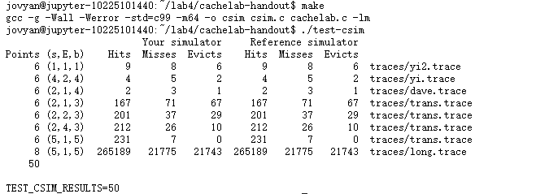
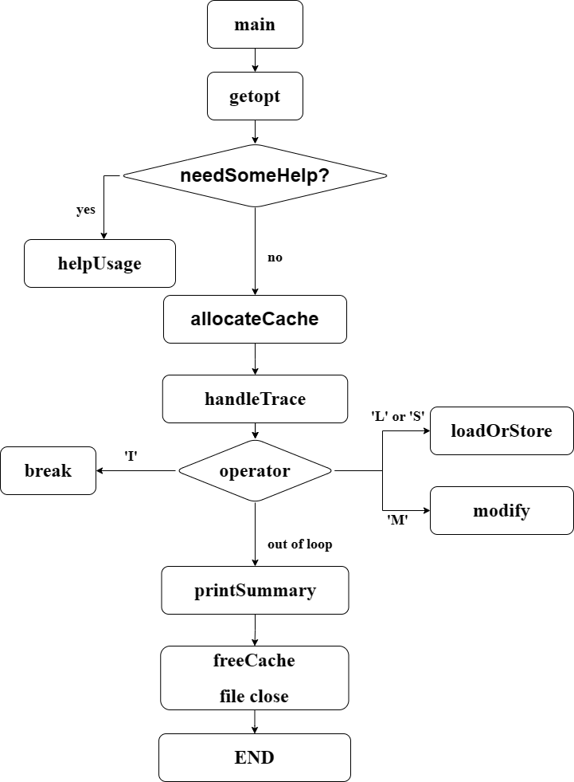

# CSAPP Lab4 CacheLab

### Cache基本结构：

Cache（高速缓存）由S个组（Set）组成，其中每个组由E个行（CacheLine）组成，每个CacheLine由B个块（Block）组成

### 实验目的：Cache行为模仿

该实验要求写一个C语言程序，该程序能够分析文件中传入的对内存的指令。指令共有四种："I", "M", "L", "S"。其中我们直接忽略指令"I"，然后对于文件中的所有操作，通过模仿Cache行为统计Cache的命中次数(countHits)，不命中次数(countMisses)以及驱逐次数（暂译，countEvictions）。

传入格式：" operator address,size" 只有operator为"I"时开头没有空格，其它都由空格开头。

**由于只需要统计这三个次数，因此我们不需要管CacheLine里到底存放了什么内容**

### 模拟Cache结构

将CacheLine的内容作为结构体，以此为Cache的基本结构，CacheLine包含有效位（bitValid），标记（tag），空闲时间（time，用于实现LRU算法）。

```C
typedef struct cacheLine{
    int bitValid;
    unsigned long tag;
    int time;
} cacheLine, *cacheSet, **cache;
```

**结构体为cacheLine，由一系列cacheLine组成cacheSet，又由一系列cacheSet组成我们要模拟的cache**

### 整体代码结构搭建

由于传参太多不仅容易导致代码复杂度提高，还可能造成程序性能下降，因此对于部分通用变量，我们将其设置为全局变量，包括三个需要统计的值(countHits, countMisses, countEvictions)，三个描述Cache的值(s, E, b)以及是否启用详细信息标志(verboseFlag)和语气配套的是否正在改写内存(isModifying，-v选项实现中详细说明)。

首先通过main函数建立整体框架。

使用getopt函数读取运行程序时输入的参数，通过
```C
while(opt=getopt(argc, argv, "hvs:E:b:t:") != -1);
```
来读取全部输入的参数，每次`while`循环对opt使用switch分支语句，分为"h, v, s, E, b, t, default"七种情况，其中`h`和`default`时启用帮助信息，我采用的方法是设置是否启用帮助信息标志(helpUsageFlag)，这样可以和其它异常一同处理。

`s`, `E`, `b`则对应给相应的变量赋值，注意使用`atoi`函数将ASCII值转为整型。

`t`情况下，在循环外设置文件指针`FILE *fp = NULL`，然后将-t的参数通过`fopen`打开并传给`fp`

`v`情况下，则将详细信息标志设置为启用(verboseFlag = 1)

读取完参数后，进行异常判断，如果选择启用帮助信息，或者传入的参数不规范，则调用函数`helpUsage`，然后退出。

如果没有异常，则为我们的cache分配内存空间，定义`allocateCache`函数完成这项工作。

接下来对传入的trace进行处理，我们定义一个函数`handleTrace`来完成这项工作。

处理完成后，调用已经给出的`printSummary`函数，给出三个数值。

最后释放内存，定义函数`freeCache`释放用于模仿cache的内存，然后将fp打开并指向的文件关闭。

### 各个部分实现

#### helpUsage

不详细说明，大量使用（用一个也行）`printf`函数打印使用方法

#### allocateCache

`cache allocateCache()`

由于已经将Cache的基本信息作为全局变量，因此不需要给该函数传入参数

该函数将创建一个指针，指向我们的cache，我们称其为`myCache`

首先给`myCache`分配组(set)，容易知道组数setNum = 1 << s，分配组: `myCache = (cache)malloc(setNum*sizeof(cacheSet))`

接下来给每个组分配cacheLine: 
```C
for(int i=0;i<setNum;i++){
    myCache[i]=(cacheSet)malloc(E*sizeof(cacheLine)); // E是每组行数
}
```
然后用双重循环给每个cacheLine赋初值，使得初始有效位bitValid=0，初始tag为-1lu，空闲时间为0；

最后将myCache返回。

#### handleTrace

#### 基本框架

`void handleTrace(FILE *fp, cache myCache)`

传入文件和已经分配好的cache，使用`while(fscanf(*) > 0)`读取文件中所有指令，同样用switch语句处理四种指令：

指令为'I'时直接跳过即可

指令为'L', 'S'时，由于二者对于需要统计的数值影响完全一致，因此定义一个函数`loadOrStore`来完成。

指令为'M'时，定义函数`modify`完成该过程。

在每轮循环后不要忘记增加空闲时间，定义函数`updateTime`来完成该过程。

##### loadOrStore

`void loadOrStore(unsigned long address, char op, int size, cache myCache)`

首先从传入的地址中获取我们需要的newSetIndex和newTag:
```C
int newSetIndex = (address>>b) % (1<<s);
unsigned long newTag = address>>(s+b);
```
先遍历newSetIndex的所有cacheLine，查找是否有tag和newTag相同且有效位为1的cacheLine，若有则命中，countHits + 1，该行的空闲时间重置为0，返回，否则，发生不命中，countMisses + 1。

若不命中，则继续执行，首先遍历所有newSetIndex的cacheLine，查找是否有有效位为0的空行，若有则将其启用，有效位改为1，tag改为newTag，空闲时间重置为0，否则发生驱逐，countEvictions + 1。

若发生驱逐，则继续以下操作：

驱逐策略采用LRU，遍历所有cacheLine，找到空闲时间最长的cacheLine，将其覆盖为当前行，即tag=newTag，同时空闲时间重置为0，返回。

LRU实现：
```C
int evictLine=0;
for(int i=0;i<E;i++){
    if(myCache[newSetIndex][i].time > myCache[newSetIndex][evictLine].time){
        evictLine = i;
    }
}
myCache[newSetIndex][evictLine].tag = newTag;
myCache[newSetIndex][evictLine].time = 0;
return;
```

##### modify

`void modify(unsigned long address, int size, cache myCache)`

有了上述`loadOrStore`函数，modify实现就变得简单了，因为modify操作事实上就是先Load再Store。

**注意Load和Store时将isModifying先置为1，两次操作完成后结束modify，将其重新置为0**

```C
isModifying = 1;
loadOrStore(address, 'L', size, myCache);
loadOrStore(address, 'S', size, myCache);
isModifying = 0;
```

##### updateTime

`void updateTime(cache myCache)`

非常容易，只要遍历每个cacheLine，当其有效位为1时就让其time+1。

```C
for(int i=0;i<setNum;i++){
    for(int j=0;j<E;j++){ // E为每个cacheSet的行数
        if(myCache[i][j].bitValid == 1) myCache[i][j].time++;
    }
}
```

#### freeCache

`void freeCache(cache myCache)`

**注意不能仅仅free(myCache)，要先把所有cacheSet先释放掉**

```C
for(int i=0;i<(1<<s);i++) free(myCache[i]);
free(myCache);
```

### -v选项

在`loadOrStore`函数中，如果需要打印详细信息（即verboseFlag=1），则在相应值+1处添加printf，内容和传入的操作符相同。注意如果isModifying=1则不在`loadOrStore`函数中打印，而只在`modify`函数中打印详细信息。

### 总结

至此，CacheLab要求的目标已经完成。



#### 结构图：


