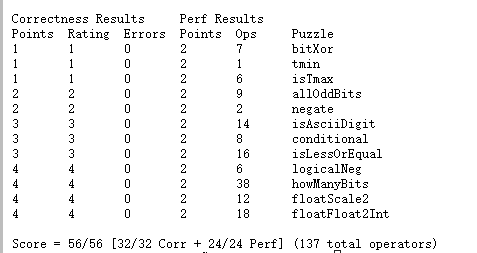

# CSAPP Lab1 DataLab

## 解题思路

### 1.bitXor

本题要求使用`~`和`&`来达到`^`的效果

根据离散数学的基础知识, `x ^ y = ~((x&y)|(~x&~y)) = ~(x&y)&~(~x&~y)`, 所以本题只要`return ~(x&y)&~(~x&~y)`即可

代码:
```C
int bitXor(int x, int y) {
  return ~(x&y)&~(~x&~y);
}
```

### 2.tmin

本题要求函数返回二进制补码表示的整型数据的最小值tmin

整型数据有32位, 最小值为最高位（即符号位）为1, 其它位均为0，故我们只需将1左移31位到符号位即可

代码: 
```C
int tmin(void) {
  return 1<<31;
}
```

### 3.isTmax

本题要求判断一个数`x`是否为二进制补码整型数据的最大值`Tmax(0x7fffffff)`, 如果是则返回1, 否则返回0

要判断一个数是否是`int`的最大值，我们可以利用溢出这一特性, 即`Tmax+1 = Tmin(0x80000000)`

而且`Tmax+Tmin = 0xffffffff`, 所以我们就得到了`2Tmax+1 = 0xffffffff`, `~0xffffffff = 0`, `!0 = 1`

通过这一系列操作, 我们就可以由`Tmax`得到1

但是这是不对的, 因为我们还没有考虑没有溢出的情况下也符合上述等式的值

通过解方程组`2x+1 = 0xffffffff`, 可以得到`x = 0xffffffff`

我们不难发现, 这两个值在进行上述计算中, `x+1`的值有所不同, 我们暂时记`i = x+1`, 当`x = 0x7fffffff`时, `i = 0x80000000`, 

而当`x = 0xffffffff`时, `i = 0`, 所以我们只需要将`~(2Tmax+1)`的值先加上`!i`再取`!`, 这样当`x = 0xffffffff`时,最后结果就会变为`!1 = 0`, 

而`Tmax`的情况不受影响, 于是我们就排除了这种情况

代码: 
```C
int isTmax(int x) {
  int i=x+1;
  x=x+i;
  x=~x;
  x=x+!i;
  return !x;
}
```

### 4.allOddBits

本题要求如果`x`的奇数位都是1, 则返回1, 否则返回0（位从0到31）

既然本题只需要判断奇数位是否全是1, 和偶数位无关, 所以我们可以把偶数位全部变成1, 这样只需要判断偶数位全变为1后的`t`是不是全1的数即可

判断的方法即为`!(~t)`

因为我们最多只能使用八位的常数, 所以我们需要通过一些移位操作来达到让32位的`int`的所有偶数位变为1, 

方法即为`t=x|(0x55|(0x55<<8)|(0x55<<16)|(0x55<<24))`

代码: 
```C
int allOddBits(int x) {
  int t=x|(0x55|(0x55<<8)|(0x55<<16)|(0x55<<24));
  return !(~t);
}
```

### 5.negate

本题要返回`x`的相反数

利用简单的公式`x+~x = -1`我们可以得到`-x = ~x+1`

代码:
```C
int negate(int x) {
  return ~x+1;
}
```

### 6.isAsciiDigit

本题要求判断`x`是否在0到9的ASCII范围内（即`0x30 <= x <= 0x39`是否为真）, 若在则返回1, 否则返回0

本题需要分别判断`x`是否大于等于`0x30`, 以及`x`是否小于等于`0x39`

我们用`isa`表示是否大于等于, 用`isb`表示是否小于等于, 是则为1, 否则为0

我们只需要`x-0x30`和`0x39-x`的符号位就可以得到`isa`和`isb`的值, 而减法的实现就采用第五题negate的方法, 让其加上减数的相反数即可,最后返回

`isa&isb`即为结果

*溢出问题*

我感觉这题不考虑溢出会出bug, 但是实际测试不考虑溢出也是可以跑过的, 但是这里还是处理一下溢出的问题, 不难发现本题只有x为负值存在溢出情况, 

同时如果x是负值则一定返回0, 所以我们最后返回`isa&isb&(!(x>>31))`即可解决

代码:
```C
int isAsciiDigit(int x) {
  int isa=!((x+(~0x30+1))>>31);
  int isb=!((0x39+(~x+1))>>31);
  return isa&isb&(!(x>>31));
}
```

### 7.conditional

本题要用限定的操作符达成三目运算符的效果

思路很简单, 我们只要得到一个`flag`, 其值为**全1**或**0**, 当flag为全1时返回值为y, 为0时返回值为z, 融合到一起就是`(flag&y)|((~flag)&z)`

如何得到**flag**呢? 我们可以利用C语言的算术右移特性, 来让**1**变为**全1**, 所以我们可以用`!!x`, 这样如果x非0则得到1, 否则得到0, 再将其

左移31位, 右移31位以得到`flag`

代码:
```C
int conditional(int x, int y, int z) {
  int flag=((!!x)<<31)>>31;
  return (flag&y)|((~flag)&z);
}
```

### 8.isLessOrEqual

本题要判断`x<=y`是否为真, 若为真则返回1, 否则返回0

本题看似很简单, 我们只需要用negate来得到`dif = y-x`, 通过`dif`的符号就可以判断x和y的大小关系

然而, 如果仅仅考虑dif的符号, 就会有溢出导致的bug。 

例如我们使用`dif = y+(~x+1)`, 若y=0x80000000, 而x为一个正数, 最后我们会得到dif的符号是正的, 而其应该为负。

经过总结我们可以发现, 当x或y为0x80000000时, 就会出现上述问题, 同时我们惊奇的发现, 如果x和y同号, 即使发生溢出, `dif`的值也是正确的, 这是因为原本的符号位被截断, 剩下的恰好是正确的符号。

所以我们就可以把这道题分成两种情况, 一是x和y异号, 二是x和y同号。

x和y异号时, 我们只要通过x和y符号位即可判断大小, 返回值为`sx&!sy`(1表示负, 0表示正)

x和y同号时, 我们通过dif的符号来判断大小, sdif为1则返回0, 否则返回1, 即为`!sdif`。加上对x和y是否同号的判断, 即为`!(sx^sy)&!sdif`

于是我们就解决了这个问题

代码:
```C
int isLessOrEqual(int x, int y) {
  int sx=(x>>31)&1;
  int sy=(y>>31)&1;
  int dif=y+(~x+1);
  int sdif=(dif>>31)&1;
  return (sx&!sy)|(!(sx^sy)&!sdif);
}
```

### 9.logicalNeg

本题要求不使用`!`操作符达成`!x`的效果

翻译一下, 就是x为0则返回1, 否则返回0

所以我们只要利用一个最简单的特性就可以区分开：即0的相反数为0

通过x和x的相反数的符号是否相同就可以完成本题, 并且我们可以利用全1的值为-1这点, 直接将值+1, 这样0就是`0+1=1`, 非0就是`-1+1=0`

代码:
```C
int logicalNeg(int x) {
  return (x>>31|(~x+1)>>31)+1;
}
```

### 10.howManyBits

本题要求返回用二进制表示`x`最少要多少位

我们可以发现, 对于负数, 我们要从左往右找到第一个0, 对于正数, 我们要从左往右找到1, 最后再加上符号位, 这样无疑让这道题变得复杂, 所以我们可以通过对负数按位取反, 正数不变, 让本题变为从左往右找到第一个1, 实现方法为`((x>>31)&~x)|(~(x>>31)&x)`

对于从左往右找到第一个1的方法, 如果使用遍历搜索, 需要的操作符太多, 所以我们采用二分查照的方法, 即对于32位的数, 先查找左边16位有没有1, 将范围缩小至16位, 再查找8位, 依此类推......

在此只详细说明一次查找过程:

以第一次为例, 将x右移16位, 并通过两次`!`运算来判断x的左边16位是否有1, 如果有, 则我们将x固定, 将结果`sum`加上16, 然后对右边16位继续进行二分查找, 如果没有, 我们将x复原, 同样继续对右边16位进行二分查找。

代码:
```C
int howManyBits(int x) {
  int sum=0;
  int nx = ((x>>31)&~x)|(~(x>>31)&x);
  int p = (!!(nx>>16))<<4;
  nx = nx>>p;
  sum+=p;
  p = (!!(nx>>8))<<3;
  nx = nx>>p;
  sum+=p;
  p = (!!(nx>>4))<<2;
  nx = nx>>p;
  sum+=p;
  p = (!!(nx>>2))<<1;
  nx = nx>>p;
  sum+=p;
  p = !!(nx>>1);
  nx = nx>>p;
  sum+=p;
  sum+=nx;
  return sum+1;
}
```
PS: 本实验似乎对变量数进行了限制, 原本想使用p16, p8...来表示二分的进度, 但是编译器会说后面的部分变量为`undeclared`, 所以最后将p重复利用, 并采用sum来对结果进行计数。

### 11.floatScale2

本题要返回一个浮点数乘以2以后的结果（用32位unsigned表示）, 如果输入`uf`为NaN, 则返回`uf`

思路就是先将浮点数拆开, 分别为符号`sign`, 阶码`exp`, 尾数`f`

首先考虑非规格化, 如果exp为0, 则返回`(uf<<1)|sign`, 如果exp为0x7f800000（对应位置的255）, 则返回`uf`

其它情况则exp加一

exp加一后再判断exp是否为0x7f800000, 若是则返回相应符号的无穷大`0x7f800000|sign`, 否则就将三者合起来返回`sign|exp|f`

代码:
```C
unsigned floatScale2(unsigned uf) {
  unsigned sign = uf&0x80000000;
  int exp=uf&0x7f800000;
  unsigned f=uf&0x007fffff;
  if(exp==0) return (uf<<1)|sign;
  else if(exp==0x7f800000) return uf;
  else exp+=0x00800000;
  if(exp==0x7f800000) return 0x7f800000|sign;
  else return sign|exp|f;
}
```

### 12.floatFloat2Int

本题要求将将一个浮点数取整, 达到`(int) uf`的效果(即将float类型强转为int类型), 如果超出范围则返回0x80000000u

本题同样将uf拆开成三部分：符号`sign`, 阶码`exp`, 尾数`f`

同样先考虑非规格化, 若exp为0则直接返回0, 若exp为255则返回0x80000000u

接着我们让exp减去127得到真正的指数

此时若exp<0, 则返回0, 若exp>=31则返回0x80000000u

最后我们只需要考虑exp和23的大小关系, 以判断尾数应该左移还是右移, 若exp大于23, 则左移`exp-23`位, 反之右移`23-exp`位

返回值根据符号位判断, 若为负, 则返回`~f+1`, 反之返回`f`

代码:
```C
int floatFloat2Int(unsigned uf) {
  unsigned sign=(uf&0x80000000)>>31;
  int exp=(uf&0x7f800000)>>23;
  unsigned f=uf&0x007fffff|0x00800000;
  if(exp==0) return 0;
  if(exp==0x7f800000) return 0x80000000u;
  exp-=127;
  if(exp<0) return 0;
  if(exp>=31) return 0x80000000u;
  if(exp>23) f=f<<(exp-23);
  else f=f>>(23-exp);
  return sign? (~f+1):f;
}
```

## 跑分截图

