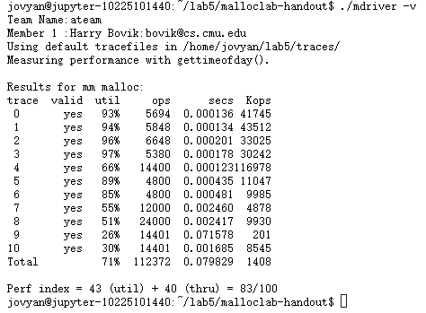

# CSAPP Lab5 MallocLab

## Author: 韩晨旭

## Student ID: 10225101440

## 实验目的：实现堆内存分配管理(malloc, free...)

本次实验需要在mm.c文件中补充四个函数，分别为`mm_init`, `mm_malloc`, `mm_free`和`mmrealloc`，并最终通过`mdriver`进行测试

## 测试结果：


### 显式空闲链表
本次采用显式空闲链表来实现堆空间的管理，即以双向链表的形式来记录堆中的空闲块。

在显式空闲链表中，每一个块都至少包含以下内容：头部（header），脚部（footer），前驱和后继（prev and succ），部分块中还含有填充（padding）

后继存放下个空闲块的指针，前驱存放上个空闲块的指针，最起始的为序言块，不含有内容，只有头部和脚部，在链表外存在一个root指向第一个空闲块

### 需要用的宏（macros）
```C
/* single word (4) or double word (8) alignment */
#define ALIGNMENT 8

/* rounds up to the nearest multiple of ALIGNMENT */
#define ALIGN(size) (((size) + (ALIGNMENT-1)) & ~0x7)


#define SIZE_T_SIZE (ALIGN(sizeof(size_t)))

/* some useful sizes */
#define WSIZE 4
#define DSIZE 8
#define MINBLOCK 24
#define CHUNKSIZE (1<<12)

/* get maximum value of x and y */
#define MAX(x, y) ((x)>(y)? (x):(y))

/* pack up size and whether allocated */
#define PACK(size, alloc) ((size)|(alloc))

/* get or put value or address(pointer) to an address */
#define GET(p) (*(unsigned int *)(p))
#define PUT(p, val) (*(unsigned int *)(p) = (val))
#define GETADDR(p)         (*(unsigned int **)(p))
#define PUTADDR(p, addr)   (*(unsigned int **)(p) = (unsigned int *)(addr))

/* get the size of the block */
#define GET_SIZE(p) (GET(p) & ~0x7)

/* whether the block is allocated */
#define GET_ALLOC(p) (GET(p) & 0x1)

/* calculate address of header or footer of block pointed by bp */
#define HDRP(bp) ((char *)(bp) - WSIZE)
#define FTRP(bp) ((char *)(bp) + GET_SIZE(HDRP(bp)) - DSIZE)

/* pointer to the memory where stores next/prev pointer */
#define NEXT_PTR(bp) ((char *)(bp))
#define PREV_PTR(bp) ((char *)(bp) + WSIZE)

/* pointer to logical next or prev block */
#define NEXT_FREE_BLKP(bp) ((char *)(*(unsigned int *)(NEXT_PTR(bp))))
#define PREV_FREE_BLKP(bp) ((char *)(*(unsigned int *)(PREV_PTR(bp))))

/* pointer to physical next or prev block */ 
#define NEXT_BLKP(bp) ((char *)(bp) + GET_SIZE(HDRP(bp)))
#define PREV_BLKP(bp) ((char *)(bp) - GET_SIZE(HDRP(bp)-WSIZE))
```

### 几个会用到的对链表的操作函数

#### void place_freelist(void *bp)

在分割时将剩余部分空闲块保持在原链表中

注意讨论前驱是根`freelist_headp`以及后继是结尾块的情况

```C
    void *prev_block = PREV_FREE_BLKP(bp);
    void *next_block = NEXT_FREE_BLKP(bp);
    void *remain_bp = NEXT_BLKP(bp);
    
    PUTADDR(NEXT_PTR(remain_bp), next_block);
    PUTADDR(PREV_PTR(remain_bp), prev_block);
    
    if(prev_block == freelist_headp){
        PUTADDR(freelist_headp, remain_bp);
    }
    else{
        PUTADDR(NEXT_PTR(prev_block), remain_bp);
    }
    
    if(next_block !=NULL){
        PUTADDR(PREV_PTR(next_block), remain_bp);
    }
```

#### void remove_freelist(void *bp)

该函数将bp指向的块移出链表

同样讨论前驱是`freelist_headp`以及后继是结尾块的情况

```C
    void *prev_block = PREV_FREE_BLKP(bp);
    void *next_block = NEXT_FREE_BLKP(bp);
    
    if(prev_block == freelist_headp){
        PUTADDR(freelist_headp, next_block);
    }
    else{
        PUTADDR(NEXT_PTR(prev_block), next_block);
    }
    
    if(next_block != NULL){
        PUTADDR(PREV_PTR(next_block), prev_block);
    }
```

#### void insert_freelist(void *bp)

该函数将bp指向的块插入链表（插入链表头部）

讨论链表是否已经被创建

```C
    if(GETADDR(freelist_headp) == NULL){
        PUTADDR(NEXT_PTR(bp), NULL);
        PUTADDR(PREV_PTR(bp), freelist_headp);
        PUTADDR(freelist_headp, bp);
    }
    else{
        void *tmp=NULL;
        tmp=GETADDR(freelist_headp);
        PUTADDR(NEXT_PTR(bp), tmp);
        PUTADDR(PREV_PTR(bp), freelist_headp);
        PUTADDR(freelist_headp, bp);
        PUTADDR(PREV_PTR(tmp), bp);
    }
```

### mm_init
#### int mm_init(void)

利用mem_sbrk函数分配序言块以及结尾块的空间，由于需要双字对齐，需要分配`4*WSIZE`的空间（第一块是对齐块），如果失败（返回值为-1）则返回-1

对序言块和结尾块进行初始化，序言块size为8，结尾为0，均为已分配

对于第一个用于对齐的空白块，我们把它作为链表的root，给它一个新的名字，叫做`freelist_headp`，并将其初始化为`NULL`

最后尝试将堆扩容至`CHUNKSIZE`，调用`extend_heap`函数，如果失败返回NULL，则`mm_init`返回-1

若均为出错，则`mm_init`正常返回0

#### extend_heap
##### void *extend_heap(size_t size)

使用`ALIGN`得到需要扩容的`asize`，接下来用`mem_sbrk`扩展`asize`

如果失败，则返回NULL

如果成功，初始化扩容后的堆，再重新设置结尾块

最后返回该指针合并(coalesce)后的指针，即`coalesce(bp)`

### mm_malloc
#### void *mm_malloc(size_t size)

如果size为0，则直接返回NULL

需要分配的空间为size加上头部和脚部，故所需要的空闲块大小至少为`ALIGN(size + 2*WSIZE)`

通过函数`find_free_block`找出一个合适的空闲块，如果能够找到这样一个块，则对该块进行分割(place)，调用`place`函数

如果没能找到合适的空闲块，则需先扩容堆，再对扩容块进行分割，扩容大小为`MAX(CHUNKSIZE, asize)`，再进行分割

最后返回分配的首地址

#### void *find_free_block(size_t size)

遍历整个空闲链表，如果有大小符合的块就返回其指针，否则返回NULL
```C
    void *current_p;
    for(current_p=GETADDR(freelist_headp);current_p!=NULL;current_p=NEXT_FREE_BLKP(current_p)){
        if(GET_SIZE(HDRP(current_p)) >= size){
            return current_p;
        }
    }
    return NULL;
```

#### void place(void *bp, size_t size)

分两种情况，第一种情况是切割后剩下的大小能够成为一个空闲块，即剩下的size >= MINBLOCK，这种情况将size进行分配，然后将剩下的部分留在链表原处

第二种则是剩下的大小不足以成为一个空闲块，于是我们直接将整个空闲块都分配出去，减少碎片

```C
    size_t block_size;
    size_t remain_size;
    block_size = GET_SIZE(HDRP(bp));
    remain_size = block_size - size;
    
    if(remain_size >= MINBLOCK){
        PUT(HDRP(bp), PACK(size, 1));
        PUT(FTRP(bp), PACK(size, 1));
        void *remain_bp;
        remain_bp = NEXT_BLKP(bp);
        PUT(HDRP(remain_bp), PACK(remain_size, 0));
        PUT(FTRP(remain_bp), PACK(remain_size, 0));
        place_freelist(bp);
    }
    else{
        PUT(HDRP(bp), PACK(block_size, 1));
        PUT(FTRP(bp), PACK(block_size, 1));
        remove_freelist(bp);
    }
```

### coalesce

#### void *coalesce(void *bp)

有四种情况，即前块是否已分配和后块是否已分配的组合

课件中有四种情况处理方法的详细说明，此处采用的处理方法为LIFO

```C
    void *prev_block = PREV_BLKP(bp);
    void *next_block = NEXT_BLKP(bp);
    int prev_alloc = GET_ALLOC(HDRP(prev_block));
    int next_alloc = GET_ALLOC(HDRP(next_block));
    size_t size = GET_SIZE(HDRP(bp));
    
    if(prev_alloc && next_alloc){
        insert_freelist(bp);
        return bp;
    }
    else if(prev_alloc && !next_alloc){
        size += GET_SIZE(HDRP(next_block));
        remove_freelist(next_block);
        insert_freelist(bp);
    }
    else if(!prev_alloc && next_alloc){
        size += GET_SIZE(HDRP(prev_block));
        bp = prev_block;
        remove_freelist(bp);
        insert_freelist(bp);
    }
    else{
        size += GET_SIZE(HDRP(next_block)) + GET_SIZE(HDRP(prev_block));
        bp = prev_block;
        remove_freelist(prev_block);
        remove_freelist(next_block);
        insert_freelist(bp);
    }
    
    PUT(HDRP(bp), PACK(size, 0));
    PUT(FTRP(bp), PACK(size, 0));
    return bp;
```

### mm_free

#### void mm_free(void *ptr)

获取ptr的大小，然后重新写它的头部和脚部，最后将其与相邻块合并(coalesce)即可

```C
    size_t size;
    size = GET_SIZE(HDRP(ptr));
    PUT(HDRP(ptr), PACK(size, 0));
    PUT(FTRP(ptr), PACK(size, 0));
    coalesce(ptr);
```

### mm_realloc

#### void *mm_realloc(void *ptr, size_t size)

按照要求，若ptr为NULL，则返回`mm_malloc(size)`

若size为0，则`mm_free(ptr)`，返回NULL

若非如此特殊情况，则进行大小的重新分配，此时又要分两种情况

一是新的大小小于等于原来的大小，这种情况我们将原来的块分割（place）即可

而是新的大小大于原来的大小，我们通过`find_free_block`找到合适的空闲块，如果找不到则`extend_heap`对堆进行扩容，大小为`MAX(CHUNKSIZE, new_size)`，然后再分割该空闲块，将原块内容复制到新的块，并将原块`mm_free`，最后返回新块指针

```C
    size_t old_size = GET_SIZE(HDRP(ptr));
    size_t new_size = ALIGN(size + 2*WSIZE);
    size_t extend_size;
    void *old_ptr = ptr;
    void *new_ptr;
    
    if(ptr == NULL){
        return mm_malloc(size);
    }
    
    if(size == 0){
        mm_free(ptr);
        return NULL;
    }
    
    if(new_size <= old_size){
        if(old_size - new_size >= MINBLOCK){
            place(old_ptr, new_size);
            return old_ptr;
        }
        else{
            return old_ptr;
        }
    }
    else{
        if((new_ptr = find_free_block(new_size)) == NULL){
            extend_size = MAX(CHUNKSIZE, new_size);
            if((new_ptr = extend_heap(extend_size)) == NULL){
                return NULL;
            }
        }
    }
    place(new_ptr, new_size);
    memcpy(new_ptr, old_ptr, old_size-2*WSIZE);
    mm_free(old_ptr);
    return new_ptr;
```

### 实验收获

本次实验中，我更深刻的理解了malloc等一系列函数的工作原理以及实现方式的多样化，加深了对显式空闲链表的印象以及理解，同时也对第九章，虚拟内存有了更多的认识

