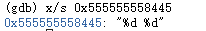

# CSAPP Lab2 BombLab
## 反汇编虚拟地址不正确的解决办法

当我们直接使用`objdump -d`进行反汇编后，我们会得到bomb的汇编代码，但是这份汇编代码各条指令或其它虚拟地址是不正确的，它们极有可能是虚拟内存的内核区域

造成这个问题的原因是程序没有运行，因此反汇编给出的地址并不是在程序运行时指令的真实地址，所以解决方法就是先在gdb里运行一下该程序，用`ctrl+c`暂停程序，再利用`disassemble`指令进行反汇编，这样我们得到的地址就是正确的

下面以`phase_1`反汇编为例进行对比：


## 解题思路
### Phase_1:
Phase_1要求输入正确的字符串


通过Phase_1的汇编代码我们发现，其调用了`string_not_equal`函数

该函数的作用是判断两个字符串是否相同，若相同则返回0，否则返回1(对string_not_equal分析，假设两个字符串相同，不难发现返回值，此处省略详细代码)

我们注意到，过程中向`%rsi`载入了一个值，表达方式是`%rip`的偏移，说明这是一个全局变量，右边#后的值即为绝对地址

`%rsi`是函数的第二个参数，说明`string_not_equal`的第一个参数`%rdi`即指向我们输入的字符串

所以只要查看上述绝对地址处储存的字符串就可以得到Phase_1的答案


通过x指令查看字符串内容，我们就得到了Phase_1的答案:

**I am not part of the problem. I am a Republican.**

### Phase_2:
Phase_2是一个循环，判断输入的六个数是否分别对应六次循环的变量值


Phase_2调用了`read_six_numbers`函数，通过其汇编代码（此处省略）可以发现，该函数读取了输入的六个数字，按照输入顺序从栈的低地址排向高地址摆放

接下来我们看到了`cmpl    $0x0, (%rsp)`, 如果为负数就跳转至爆炸，说明输入的第一个数大于等于0，接下来将`%ebx`赋值1，`%rbp`为栈顶指针（当前指向输入的第一个数）

接下来jmp到循环体，进行6次循环，第i次循环时`%rbp`指向输入的第i个数，可以得出这六个数的递推关系：`num(i) = num(i-1) + i-1`

我们将num(1)设为1，则可以得到其中一种答案：

**1 2 4 7 11 16**

### Phase_3:
Phase_3是一个~~switch语句的跳转表~~，因为好像实现比较怪，但基本原理类似跳转表


通过观察发现首先将一个地址给到了`%rsi`，后续引用了`sscanf`函数，因此我们知道第二个参数是一个字符串，能够告诉我们输入格式，于是我们使用

`x/s 0x555555558445`

查看输入格式



所以我们知道了本题要输入两个整数，储存顺序由低地址向高地址

将第一个数与7进行无符号比较，如果大于则跳转至爆炸，于是我们可以得出输入的第一个数num1的范围[0, 7]

将`num1`放入`%eax`，通过后续对`%rdx`的使用方式，不难猜测这是一个`int`类型的数组，又因为num1有八种取值，通过分析可以猜测该数组长度为8，因此通过

`x/8dw 0x5555555581c0`

查看该数组的值


我们假设输入的num1为0来得到一组答案

通过计算`%rdx+%rax`得到当前`%rax`的值，即对应跳转的地址，经计算num1为0时，其为0x0000555555556765，此时`%eax`内为0x10d，即269

接下来将num2与`%eax`比较，不相等则爆炸，相等则结束，故num1为0时，num2为269，因此其中一个答案为:

**0 269**

### Phase_4:
Phase_4是一个递归调用，要求输入输入值和递归后的返回值

Phase_4的汇编代码：


func4的汇编代码：


通过和Phase_3一样的方法发现本次同样要求输入两个整形数据，但是注意输入顺序不同，是从高地址向低地址输入

继续观察，发现其将`num2-2`与2进行无符号比较，如果不是小于等于就引爆炸弹，因此我们可以得到num2的范围：[2, 4]

接下来对func4的参数进行赋值，可以发现func4的参数应该有两个，第一个是6，第二个是num2，继续看Phase_3，发现最终要求num1和上方func4的返回值相同，否则爆炸

因此，我们当前目标就是求出`fun4(6, num2)`的返回值

对func4汇编代码分析：

我们假设`int func4(int n, int num)`

当`num=0`时，func4返回返回0，当`num=1`时，返回`num`

其它情况下将执行递归调用，一次`func4`调用了两次`func4`，我们先假设我们知道了这两次的返回值

第一次调用时第一个参数减1，将返回值加上`num`放入`%r12d`，即`%rax+%rbp`

第二次调用时第一个参数减2，将第二个参数重新设置为`num`，将返回值加上`%r12d`，作为本次`func4`的返回值，即`%eax=%eax+%r12d`

由此我们可以写出递归式：

**fun4(n, num) = func4(n-1, num) + func4(n-2, num) + num**

同样，假设我们输入的`num2`为2，我们由此递归式求`num1`，即func4(6, 2)，此时`func4(0, 2)=0, func4(1, 2)=2`，于是我们算出了：

**func4(6, 2) = 40**

因此，本题的一种答案为：

**40 2 ~~DrEvil~~**

### Phase_5:
Phase_5要求输入长度为6的字符串，其中这六个字符满足一些特殊条件


通过前面几行，我们发现要求输入的字符串长度必须为6，否则跳转至爆炸

之后向`%rax`放入输入字符串的首地址，让`%rdi=%rax+6`，向`%rsi`中放入某一`int`类型数组`array`的首地址，通过`%edx`访问数组不同index的元素，对汇编代码分析，容易发现当前`%edx`的值为某一个字符ASCII码低4位的值，因此最大值为`1111`，转换为10进制为`15`，则数组长度为16

通过`x/16dw 0x5555555581e0`查看array：


继续分析，发现这部分通过循环遍历了字符串的每个字符，并将每个字符低四位作为index的array的值加给`%ecx`，最终要求`%ecx`的值为`0x2b`，即43

其中一种通过array的6个值相加得到43的方法为:`2+10+6+1+12+12`，对应的index为:`0 1 2 3 4 4`, 故六个字符的ASCII码的低四位依次为`0000 0001 0010 0011 0100 0100`，查ASCII码表，得出其中一个可行的答案为：

**pabcdd**

### Phase_6:
Phase_6是一个链表，要求按输入的序号重构链表，使链表内的值满足某一关系


(由于内容太长省略最后复原栈的内容)

Phase_6调用`read_six_numbers`函数向栈中输入了6个数字，接下来是一个双层循环，外层循环遍历6个数字的每一个，内层循环遍历当前外层循环所在数字之后的数字，并比较是否相同，如果相等则爆炸。

由此，输入部分的汇编代码保证了输入的数字有6个，都在范围[1, 6]内，且互不相等。

我们看到向`%rdx`中放入了一个地址，名字为`node1`，根据上下文以及x指令查看内容，猜测为一个结构体，存放了三个数据，分别是：值，编号，下一个节点的地址，该结构体的大小为16Byte


结构体大致为：

```C
struct node{
    int a;
    int num;
    struct node *next;
};
```

需要注意的是后面2个4Byte合起来表示下一个节点的地址，由于该机器采用`little endian`存储，故将第四个数据在前，第三个数据在后进行拼接即下一个节点的地址

回到后续汇编代码，后续的操作又一次遍历了输入的六个数字，依次将这六个数字对应编号的节点的地址存入栈中

接下来的一系列mov操作，其实是重构整个链表，按照刚刚存入栈中的六个地址的顺序，重构整个链表，让输入的第一个编号对应的节点指向输入的第二个编号对应的节点，依此类推，最后一个节点的地址赋为0，即空指针

接下来又是一个循环，循环遍历重构后链表的第一个节点到第五个节点，每次循环将当前节点的值`a(i)`与下一个节点的值`a(i+1)`进行比较，如果小于等于则继续循环，否则爆炸

于是我们知道了这道题的要求，其实是要按照我们输入的顺序重新构造链表，使链表的值逐渐增大（即当前节点的值小于等于下一个节点的值）

由此我们可以得出本题的答案:

**3 1 6 2 5 4**

## ~~Top Secret~~

### ~~secret_phase~~

#### ~~entrance:~~

在bomb.c中我们发现了这样一段注释：

```C
/* Wow, they got it!  But isn't something... missing?  Perhaps
     * something they overlooked?  Mua ha ha ha ha! */
```

漏了什么呢？我们在bomb的汇编代码中发现了有一个叫做`secret_phase`的函数

~~看来是漏掉了隐藏关卡~~

在bomb的汇编代码中，我们搜索`secret_phase`，发现其在`phase_defused`中有引用：


通过分析，我们发现只有当输入的内容大于6个时，才会jmp到可能调用`secret_phase`的部分，因此进入`secret_phase`的必要条件是完成前面六个phase

继续向下看，发现后面调用了`sscanf`函数，并且有了两个参数对应的地址，于是我们使用使用gdb在调用`sscanf`函数处设置一个断点，通过x指令来查看当前调用`sscanf`函数的参数是什么(通常`sscanf`函数的前两个参数都是字符串，因此我们直接使用`x/s`指令)


我们发现`sscanf`函数要读取值的有三个，两个是整形数据，一个是字符串，然而读取的目标串中只含有两个整形数据，那么第三个参数（即字符串）是什么，有什么用呢？

我们继续看下面，如果成功读取到了三个值，那么就会继续后面的一个判断，这里调用了`string_not_equal`函数，将输入的字符串与某一字符串比较，通过`x/s`指令查看该字符串：


所以我们要输入的第三个参数就是一个字符串：`DrEvil`，加上我们发现`sscanf`读取的字符串是`40 2`，是我们在拆除`phase_4`时输入的内容，所以我们就找出了(~~隐藏关卡的进入方法~~)secret_phase的开启方式，就是在phase_4的答案后增加一个`DrEvil`

#### ~~solution:~~

接下来我们破解`secret_phase`，其分为两个部分，`secret_phase`和`fun7`：

secret_phase:


fun7:


前部分将以字符串形式输入的数据转换为数字，然后放入`%ebx`中，且输入的数字`num`满足`0=<num-1<=1000`，故`num`的范围为[1, 1001]

接下来调用`fun7`，第二个参数为输入的`num`，第一个参数是一个全局变量，通过其首地址查看该部分存放的值，不断使用x指令找出所有的值


通过观察，可以发现这是一连串的结构体，其中存有一个值`n`以及两个地址，观察每个节点的两个地址，发现这应该是一个二叉树，`n`中是当前节点的数值，两个地址分别为该点的左孩子和右孩子节点的地址

我们将这个二叉树构造出来(转换为10进制)：

                                      36
                                 8         50
                              6    22   45    107
                              
接下来调用函数`fun7`：

fun7首先判断是否是空指针，若为空则返回-1，接下来判断当前指针对应节点的`n`和输入的`num`的关系，如果相等则返回0，如果`num<n`则递归调用`fun7`，当前指针为该节点的左孩子，返回值为`2*递归调用的返回值`，如果`num>n`则递归调用`fun7`，当前指针节点为该节点的右孩子，返回值为`2*递归调用的返回值+1`

接下来我们回到`secret_phase`的代码，发现其将返回值与3比较，如果不相等则跳转至爆炸，说明本题要求我们输入一个`num`，使得`fun7`的返回值为3

我们容易发现，`2*0+1=1`，`2*1+1=3`，所以如果我们输入一个树第三层的数，能够每次都移向该节点的右孩子，且最后的节点的值就是该数，那么该数就是本题的一个答案，于是我们发现`107`就是一个符合条件的答案

对其他答案的讨论省略       ~~对，就是太菜了，而且还懒~~

最后完整拆弹过程：

